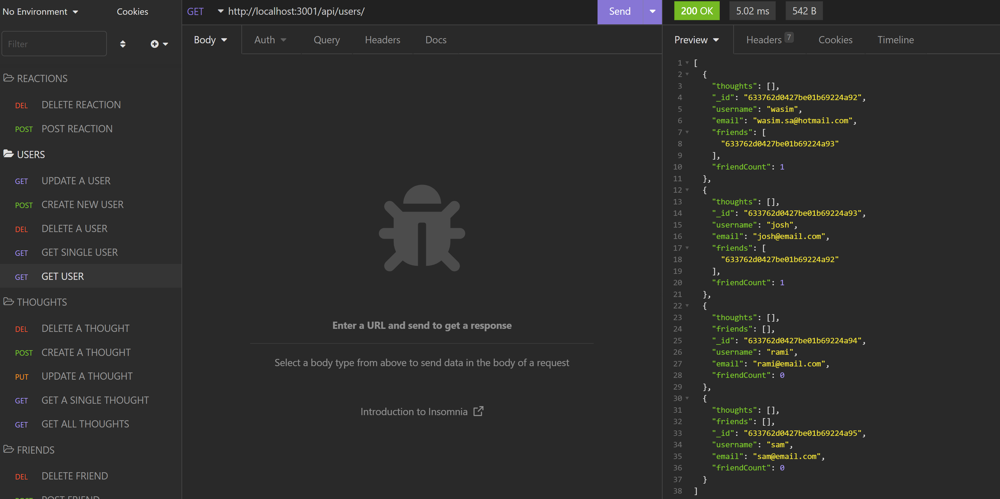
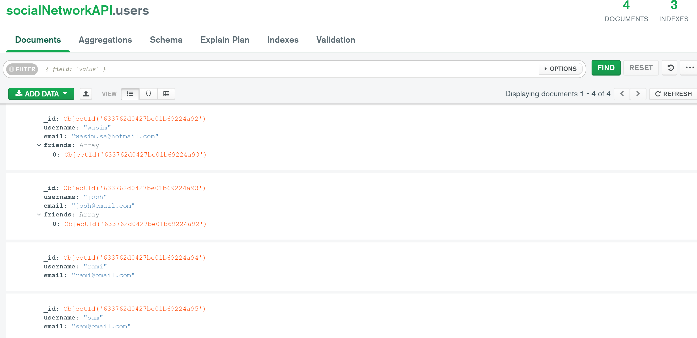

# Title of the Project:

# social-network-API

## Description:

## This challenge is made with express.js, mongoDB, and node.js and its a social network api. I used all the CRUD operation and tested the routes with Insomnia.

## Table of Content:

1. [Installation Instructions](#installation)
2. [Usage Information](#usage)
3. [License Information](#License)
4. [Contribution](#contributing)
5. [Tests](#tests)
6. [Questions](#questions)

## installation:

## 1. run command "npm i in root folder to install dependancies"

## 2. run command "npm run user-seed" 
## 3. run command "npm run thought-seed" 

## 4. run command "npm node server.js" to start the server.

## 5. test the routes with Insomnia.

## Usage:

## to be used CRUD operation

## License: N/A

## contributing:

## Built solo

## Tests:

## N/A

## Questions:

you can finde my GitHub at:

## [wasim202](https://github.com/wasim202)

If you have any questions please email me at:

## wsmohd87@gmail.com

## [Video link](https://drive.google.com/file/d/1Pg2Ov6CyGw6R6OoJ_zJ1wX0tqgTQsKmZ/view)
